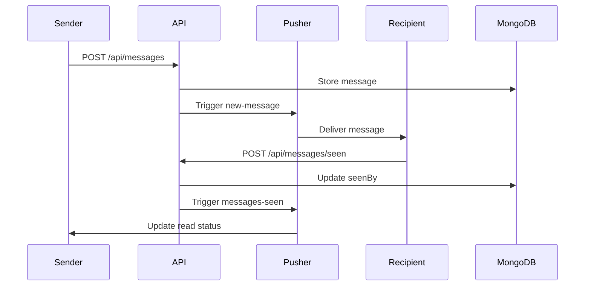

Dưới đây là nội dung file `README.md` mô tả toàn bộ hệ thống chat (các tính năng, công nghệ sử dụng, cấu trúc và hướng dẫn triển khai). Bạn có thể lưu với tên `README.md` hoặc `SYSTEM_DESCRIPTION.md`.

```markdown
# Hệ thống Chat 1-1 Real-time với Admin, Ảnh "Xem một lần" và Trạng thái "Đã đọc"

## 📌 Tổng quan
Hệ thống chat hoàn chỉnh cho phép người dùng:
- Nhắn tin **1-1** (private) với nhau.
- Gửi **ảnh bình thường** hoặc **ảnh xem một lần** (hết hạn sau 5 giây, người nhận chỉ xem được một lần).
- **Thu hồi tin nhắn** (chỉ chủ sở hữu, admin vẫn thấy nội dung gốc).
- **Trạng thái đã đọc** (seen) – hai tick xanh khi người nhận mở phòng chat.
- **Quản trị viên** (admin) có thể xem tất cả các cuộc trò chuyện (read‑only) mà không làm ảnh hưởng đến trạng thái seen.
- **Phân trang tin nhắn** – tải 10 tin nhắn/lần, có nút “Xem tin nhắn cũ”.
- **Realtime** qua Pusher – tin nhắn mới, xóa, seen được cập nhật ngay.
- **Upload ảnh trực tiếp lên Cloudinary** (client‑side) – tránh quá tải serverless, hỗ trợ nén ảnh.

---

## 🛠 Công nghệ sử dụng

| Thành phần       | Công nghệ                                                      |
| ---------------- | -------------------------------------------------------------- |
| Framework        | Next.js 16 (App Router, Turbopack)                             |
| Ngôn ngữ         | TypeScript                                                     |
| Database         | MongoDB (Mongoose ODM)                                         |
| Realtime         | Pusher (channels)                                              |
| Xác thực         | Cookie `auth_session` (httpOnly)                               |
| Upload ảnh       | Cloudinary (unsigned preset) + nén client (`compressImage`)    |
| UI               | Tailwind CSS + shadcn/ui components                            |
| State management | React hooks (`useState`, `useEffect`, `useRef`, `useCallback`) |

---

## 📁 Cấu trúc thư mục quan trọng

```
├── app/
│   ├── admin/                 # Trang admin (quan sát viên)
│   ├── api/                   # API routes
│   │   ├── admin/rooms        # Lấy danh sách tất cả phòng (admin)
│   │   ├── login/             # Đăng nhập (set cookie)
│   │   ├── messages/          # GET (phân trang, xử lý deleted/seen) & POST (tạo tin nhắn)
│   │   ├── messages/[id]/     # DELETE (thu hồi), once-viewed (đánh dấu ảnh once)
│   │   ├── messages/seen/     # Đánh dấu đã đọc
│   │   ├── rooms/             # Lấy danh sách phòng của user thường
│   │   ├── rooms/start/       # Tạo roomId mới (private)
│   │   ├── users/search/      # Tìm kiếm user (bắt đầu chat mới)
│   ├── page.tsx               # Giao diện chính (user thường)
├── components/
│   ├── chat/
│   │   ├── chat-container.tsx # Khung chat, tự động scroll, gọi seen
│   │   ├── chat-input.tsx     # Ô nhập, upload ảnh, chọn chế độ once/normal
│   │   ├── message-item.tsx   # Hiển thị tin nhắn, ảnh once (timer, modal), thu hồi, seen tick
│   │   ├── conversation-list.tsx # Danh sách các cuộc trò chuyện (có realtime refresh)
│   │   ├── user-search.tsx    # Tìm user và tạo phòng mới
├── hooks/
│   └── use-chat.tsx           # Load tin nhắn, phân trang, lắng nghe Pusher events
├── lib/
│   ├── client.ts              # Pusher client singleton
│   ├── server.ts              # Kết nối DB, Pusher server, Cloudinary config
│   ├── utils.ts               # `compressImage`, `getPrivateRoomId`, `cn`
├── models/
│   ├── Message.ts             # Schema: text, imageUrl, imageMode, onceViewedBy, deleted, seenBy...
│   ├── User.ts                # username, password (hash), isAdmin
```

---

## 🚀 Cài đặt và chạy môi trường development

### 1. Clone repository và cài dependencies
```bash
git clone <your-repo>
cd something
npm install
```

### 2. Tạo file `.env.local` (xem mẫu dưới)
```env
# MongoDB
MONGODB_URI=mongodb+srv://<user>:<pass>@cluster.mongodb.net/chat

# Pusher
PUSHER_APP_ID=xxxxxx
PUSHER_KEY=xxxxxxxxxxxxxxxx
PUSHER_SECRET=xxxxxxxxxxxxxxxx
PUSHER_CLUSTER=ap1
NEXT_PUBLIC_PUSHER_KEY=xxxxxxxxxxxxxxxx
NEXT_PUBLIC_PUSHER_CLUSTER=ap1

# Cloudinary
CLOUDINARY_CLOUD_NAME=your_cloud_name
NEXT_PUBLIC_CLOUDINARY_CLOUD_NAME=your_cloud_name
CLOUDINARY_API_KEY=123456789
CLOUDINARY_API_SECRET=abc123
NEXT_PUBLIC_CLOUDINARY_UPLOAD_PRESET=chat_unsigned
```

> **Lưu ý:** Upload preset trên Cloudinary phải có chế độ **Unsigned**.

### 3. Chạy development server
```bash
npm run dev
```
Truy cập `http://localhost:3000`

---

## 📝 Luồng hoạt động chính

### Đăng nhập / Đăng ký
- Dùng `AuthForm` gọi API `/api/login` hoặc `/api/register`.
- Thành công → lưu user vào `localStorage` (`chat-user`) và server set cookie `auth_session` (httpOnly).
- Nếu user có `isAdmin: true` → chuyển hướng về `/admin`.

### Chat 1-1 giữa hai user thường
- Khi A tìm B qua `UserSearch` → gọi `/api/rooms/start` → nhận `roomId = room-{idA}-{idB}` (sắp xếp id).
- A gửi tin nhắn → `POST /api/messages` với `roomId`, `text`, `imageUrl`, `imageMode`.
- Pusher trigger `new-message` đến kênh `chat-${roomId}` → cả hai nhận và thêm vào state.
- Khi B mở phòng → `ChatContainer` gọi `POST /api/messages/seen` → cập nhật `seenBy` cho tin nhắn của A → trigger `messages-seen` → A thấy ✓✓.

### Ảnh “xem một lần” (once)
- Người gửi chọn chế độ `once` trong `ChatInput`.
- Ảnh được upload lên Cloudinary (client) và gửi `imageMode: "once"` cùng tin nhắn.
- **Người nhận**: thấy nút “Xem ảnh” → bấm vào → modal hiện, đếm ngược 5s → sau 5s modal đóng, gọi API `once-viewed` → không thể xem lại.
- **Người gửi (và admin)**: ảnh hiển thị trực tiếp (không timer, có thể xem lại nhiều lần).

### Thu hồi tin nhắn
- Chỉ người gửi mới có nút thùng rác (hover).
- Gọi `DELETE /api/messages/[id]` → đánh dấu `deleted: true`.
- Server trigger `message-deleted` → client cập nhật:
  - Người thường: thay nội dung bằng “[Tin nhắn đã bị gỡ]” (xóa ảnh).
  - Admin: vẫn thấy nội dung gốc + nhãn “(đã thu hồi)”.

### Admin (quan sát viên)
- Vào `/admin`, đăng nhập tài khoản có `isAdmin: true`.
- Admin thấy danh sách **tất cả các room** (cả user-admin và user-user) qua API `/api/admin/rooms`.
- Khi chọn một room, `ChatContainer` được render với `readOnly={true}` → không có ô nhập tin nhắn, không gọi seen.
- Admin xem nội dung các tin nhắn (kể cả ảnh once, tin nhắn đã thu hồi) mà không làm thay đổi trạng thái đã đọc.

---

## 🧪 Triển khai lên Vercel

### Chuẩn bị
- Đẩy code lên GitHub/GitLab.
- Tạo project trên Vercel, liên kết với repository.

### Cấu hình biến môi trường
Vào **Settings → Environment Variables** và thêm tất cả các biến trong `.env.local`.

### Lưu ý với MongoDB
- Sử dụng **MongoDB Atlas** (đã có sẵn).
- Vercel Functions có giới hạn thời gian (Hobby: 10s). Với cơ chế upload ảnh **client‑side**, API `/api/messages` chỉ xử lý JSON (không upload file) nên thời gian rất thấp (< 1s).

### Build và deploy
Vercel tự động build với `npm run build`. Sau khi deploy, ứng dụng chạy ổn định.

---

## 🐛 Xử lý lỗi thường gặp

| Lỗi                                                   | Nguyên nhân                                                      | Cách khắc phục                                                                                          |
| ----------------------------------------------------- | ---------------------------------------------------------------- | ------------------------------------------------------------------------------------------------------- |
| `Cannot read properties of undefined (reading '_id')` | `user` hoặc `currentUser` chưa được khởi tạo khi component mount | Thêm guard `if (!user?._id) return null;` ở đầu component (sau các hook).                               |
| Upload ảnh lỗi `upload preset must be whitelisted`    | Preset chưa ở chế độ Unsigned                                    | Vào Cloudinary dashboard → Settings → Upload presets → chọn preset hoặc tạo mới với Mode: **Unsigned**. |
| Pusher không nhận event                               | Key/Cluster sai hoặc client chưa subscribe đúng kênh             | Kiểm tra biến môi trường, dùng `console.log` trong `channel.bind`.                                      |
| Tin nhắn realtime không hiển thị                      | `useChat` không chạy lại khi `roomId` thay đổi                   | Đảm bảo `roomId` được truyền đúng và dependency array `[roomId]`.                                       |

---

## 📄 License
MIT

---

## 👥 Tác giả
Phát triển bởi phatnguyen03022001@gmail.com – dự án học tập và thực hành Next.js + Realtime Chat.
```

Bạn có thể lưu nội dung trên vào file `README.md` hoặc `SYSTEM_DESCRIPTION.md` tùy ý. Nếu cần bổ sung hoặc chỉnh sửa phần nào, hãy cho tôi biết.


# System Design: Real-time Chat Application

## Overview
A real-time chat system supporting 1-1 private messaging with advanced features including once-viewed images, message recall, read status tracking, and admin monitoring capabilities.

## Architecture Overview

### High-Level Architecture
```
┌─────────────────┐     ┌─────────────────┐     ┌─────────────────┐
│   Client        │────▶│   Next.js API   │────▶│   MongoDB       │
│   (Next.js)     │     │   Routes        │     │   Database      │
└─────────────────┘     └─────────────────┘     └─────────────────┘
         │                        │                        │
         │                        │                        │
         ▼                        ▼                        ▼
┌─────────────────┐     ┌─────────────────┐     ┌─────────────────┐
│   Pusher        │     │   Cloudinary    │     │   Authentication│
│   (Realtime)    │     │   (Image CDN)   │     │   (Cookie)      │
└─────────────────┘     └─────────────────┘     └─────────────────┘
```

### Technology Stack
- **Frontend**: Next.js 16 (App Router) with TypeScript
- **Backend**: Next.js API Routes (Serverless Functions)
- **Database**: MongoDB with Mongoose ODM
- **Realtime**: Pusher Channels
- **Authentication**: HTTP-only cookies with session management
- **Image Upload**: Cloudinary with client-side compression
- **UI Framework**: Tailwind CSS + shadcn/ui components
- **State Management**: React hooks with custom hooks

## Core Features Design

### 1. Authentication & Authorization
#### Session Management
- Uses HTTP-only cookies (`auth_session`) for security
- Session validation on each API request
- Admin role detection via `isAdmin` flag in User model

#### User Types
- **Regular Users**: Can chat 1-1, send/receive messages
- **Admin Users**: Can monitor all conversations in read-only mode

### 2. Chat Room Management
#### Room ID Generation
```typescript
// Room ID format: room-{userId1}-{userId2}
// IDs are sorted to ensure consistent room creation
function getPrivateRoomId(userId1: string, userId2: string): string {
  const sorted = [userId1, userId2].sort();
  return `room-${sorted[0]}-${sorted[1]}`;
}
```

#### Room Types
1. **Private Rooms**: 1-1 conversations between two users
2. **Admin Rooms**: Read-only monitoring rooms for admin users

### 3. Message System Design

#### Message Model Schema
```typescript
interface Message {
  roomId: string;           // Room identifier
  userId: ObjectId;         // Sender ID
  username: string;         // Sender username
  text: string;             // Message text (empty for image-only)
  imageUrl?: string;        // Cloudinary URL
  imageMode: 'normal' | 'once';  // Image viewing mode
  onceViewedBy: ObjectId[]; // Users who have viewed once-image
  deleted: boolean;         // Soft delete flag
  deletedAt?: Date;         // Deletion timestamp
  seenBy: ObjectId[];       // Users who have read the message
  createdAt: Date;
  updatedAt: Date;
}
```

#### Message Lifecycle
1. **Creation**: User sends message → API validates → Stores in DB → Pusher broadcast
2. **Delivery**: Real-time update via Pusher to all room participants
3. **Read Status**: Marked as read when recipient opens chat room
4. **Deletion**: Soft delete with different views for sender vs admin

### 4. Real-time Communication

#### Pusher Channel Structure
- **User Channels**: `user-{userId}` for room list updates
- **Room Channels**: `chat-{roomId}` for message events
- **Event Types**:
  - `new-message`: New message created
  - `message-deleted`: Message soft deleted
  - `messages-seen`: Messages marked as read

#### Event Flow


### 5. Once-Viewed Images Feature

#### Client-Side Implementation
```typescript
// Image upload flow
1. User selects image with "once" mode
2. Client compresses image using `compressImage()` utility
3. Direct upload to Cloudinary using unsigned preset
4. On success, send message with `imageMode: "once"`
```

#### Viewing Logic
- **Recipient**: Sees "View Image" button → 5-second countdown → Marks as viewed
- **Sender/Admin**: Sees image directly without restrictions
- **Once-viewed tracking**: `onceViewedBy` array prevents re-viewing

#### Security Considerations
- Client-side upload prevents serverless timeout issues
- Cloudinary unsigned preset with domain restrictions
- 5-second viewing window with automatic expiration

### 6. Message Recall System

#### Soft Delete Implementation
```typescript
// DELETE /api/messages/[id]
1. Check if requester is message owner
2. Set `deleted: true` and `deletedAt: Date.now()`
3. Trigger `message-deleted` event via Pusher
4. Clients update UI based on user type
```

#### View Differences
- **Regular Users**: See "[Message deleted]" placeholder
- **Admin Users**: See original content with "(recalled)" indicator
- **Image Handling**: Images are hidden for regular users, visible for admins

### 7. Read Status Tracking

#### Implementation Details
```typescript
// POST /api/messages/seen
1. User opens chat room
2. Client sends all unread message IDs
3. Server adds user ID to `seenBy` array
4. Trigger `messages-seen` event
5. Sender sees ✓✓ (double checkmark) indicator
```

#### Admin Consideration
- Admin viewing doesn't trigger read status updates
- `readOnly={true}` prop prevents seen API calls
- Admin can monitor conversations without affecting user experience

### 8. Admin Monitoring System

#### Architecture
- Separate `/admin` route with admin-only access
- Real-time user activity tracking via heartbeat
- Read-only chat interface with full message visibility
- Ability to view recalled messages and once-viewed images

#### Data Access
- Admin can view all rooms via `/api/admin/rooms`
- Paginated room list with participant information
- Real-time updates via Pusher for new conversations

## Database Design

### Collections

#### Users Collection
```javascript
{
  _id: ObjectId,
  username: String,      // Unique username
  password: String,      // Hashed password
  isAdmin: Boolean,      // Admin flag
  lastActive: Date,      // Last heartbeat timestamp
  createdAt: Date,
  updatedAt: Date
}
```

#### Messages Collection
```javascript
{
  _id: ObjectId,
  roomId: String,        // room-{id1}-{id2}
  userId: ObjectId,      // Sender reference
  username: String,      // Sender username
  text: String,          // Message content
  imageUrl: String,      // Optional image URL
  imageMode: String,     // 'normal' or 'once'
  onceViewedBy: [ObjectId], // Users who viewed once-image
  deleted: Boolean,      // Soft delete flag
  deletedAt: Date,       // Deletion timestamp
  seenBy: [ObjectId],    // Users who read the message
  createdAt: Date,
  updatedAt: Date
}
```

### Indexes
1. `{ roomId: 1, createdAt: -1 }` - Message pagination
2. `{ roomId: 1, seenBy: 1 }` - Unread message queries
3. `{ userId: 1, createdAt: -1 }` - User message history

## API Design

### Authentication Endpoints
- `POST /api/login` - User login with session cookie
- `POST /api/register` - User registration
- `POST /api/logout` - Session termination
- `GET /api/me` - Current user session validation

### Chat Endpoints
- `GET /api/messages` - Paginated messages with cursor
- `POST /api/messages` - Send new message
- `DELETE /api/messages/[id]` - Recall message
- `POST /api/messages/seen` - Mark messages as read
- `POST /api/messages/[id]/once-viewed` - Mark once-image as viewed

### Room Management
- `GET /api/rooms` - User's conversation list
- `POST /api/rooms/start` - Create new private room
- `GET /api/admin/rooms` - All rooms (admin only)

### User Management
- `GET /api/users` - User list with pagination
- `GET /api/users/search` - User search for new chats
- `POST /api/users/heartbeat` - Update user activity status

## Security Considerations

### Authentication Security
- HTTP-only cookies prevent XSS token theft
- Session validation on all API endpoints
- Password hashing with bcrypt

### Authorization
- Room access validation for message sending
- Admin-only route protection
- Message ownership validation for deletion

### Data Privacy
- Regular users see anonymized usernames ("someone")
- Admin sees actual usernames for monitoring
- Once-viewed images have strict access control

### Image Upload Security
- Client-side upload to Cloudinary prevents server overload
- Unsigned preset with domain whitelisting
- Image compression before upload

## Performance Optimizations

### Database
- Compound indexes for common query patterns
- Lean queries for read operations
- Pagination with cursor-based approach

### Real-time Updates
- Efficient Pusher channel subscription management
- Event batching where possible
- Client-side state synchronization

### Client-Side
- Virtualized lists for message rendering
- Image lazy loading
- Optimistic UI updates

## Scalability Considerations

### Serverless Architecture
- Next.js API routes scale automatically on Vercel
- MongoDB Atlas for database scaling
- Pusher Channels for real-time scalability

### Database Scaling
- Sharding potential by `roomId` or `userId`
- Read replicas for admin monitoring queries
- Connection pooling optimization

### Real-time Scaling
- Pusher handles connection management
- Channel partitioning by room ID
- Event rate limiting considerations

## Deployment Architecture

### Vercel Deployment
- Serverless functions with 10s timeout (Hobby plan)
- Environment variables for sensitive configuration
- Automatic CI/CD from Git repository

### Environment Configuration
```env
# MongoDB
MONGODB_URI=mongodb+srv://...

# Pusher
PUSHER_APP_ID=...
PUSHER_KEY=...
PUSHER_SECRET=...
PUSHER_CLUSTER=...

# Cloudinary
CLOUDINARY_CLOUD_NAME=...
CLOUDINARY_API_KEY=...
CLOUDINARY_API_SECRET=...
NEXT_PUBLIC_CLOUDINARY_UPLOAD_PRESET=...
```

### Monitoring & Logging
- Vercel analytics for performance monitoring
- MongoDB Atlas monitoring
- Pusher dashboard for real-time metrics
- Custom logging for critical operations

## Future Enhancements

### Planned Features
1. **Group Chats**: Multi-user conversation support
2. **File Sharing**: Document and other file types
3. **Voice Messages**: Audio recording and playback
4. **Video Calls**: WebRTC integration
5. **Message Reactions**: Emoji reactions to messages
6. **Message Pinning**: Important message highlighting
7. **Search Functionality**: Message content search
8. **Export Conversations**: Data export for users

### Technical Improvements
1. **Redis Caching**: Frequently accessed data
2. **Message Queue**: For high-volume message processing
3. **CDN Integration**: For global asset delivery
4. **Analytics Dashboard**: User engagement metrics
5. **Automated Testing**: Comprehensive test suite
6. **Type Safety**: Enhanced TypeScript definitions

## Conclusion

This design document outlines a scalable, secure real-time chat system with unique features like once-viewed images and admin monitoring. The architecture leverages modern technologies to provide a responsive user experience while maintaining security and scalability.

The system is designed to handle real-time communication efficiently while providing administrative oversight capabilities. The modular architecture allows for future enhancements and scaling as user base grows.